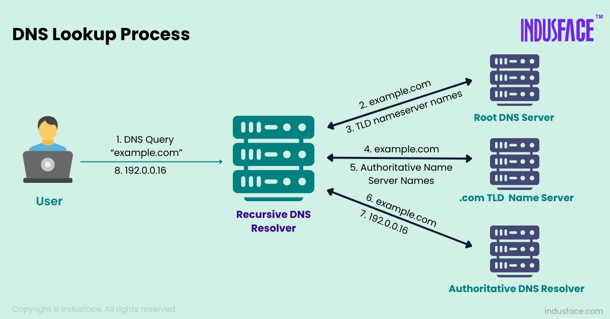

# DNS

## DNS là gì

Domain Name System (DNS) là hệ thống phân giải tiên miền, giúp dịch domain name thành các địa chỉ ip.

## Các loại record DNS

Một số loại record thông dụng:

| Loại record | ý nghĩa |
| :---: | :--- |
| A record | lưu giữ địa chỉ IPv4 của domain |
| AAAA record | Lưu giữ địa chỉ IPv6 của domain |
| CNAME record | trỏ một domain hay subdomain tới một domain khác, không lưu địa chỉ IP |
| MX record | Điều hướng email tới email server |
|TXT record | cho phép lưu giữ text trên DNS |
| NS record | lưu trữ thông tin name server của DNS có thẩm quyền |
| SOA record | lưu trữ thông tin của admin đối với domain |
| SRV record | thông tin một số port cho các service nhất định |
| PTR record | ngược với A record |

## Nguyên tác làm việc của DNS

## Cách phân giaỉ địa chỉ DNS

