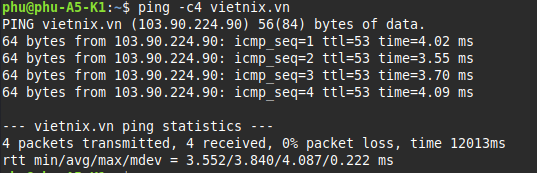
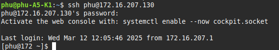
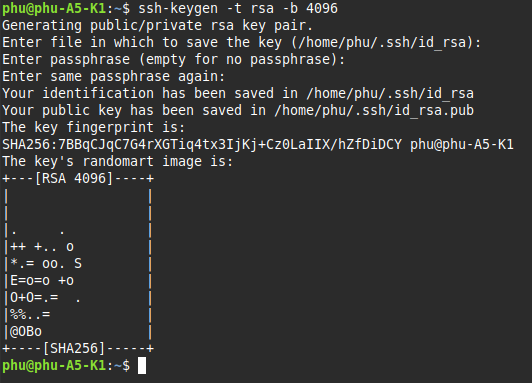
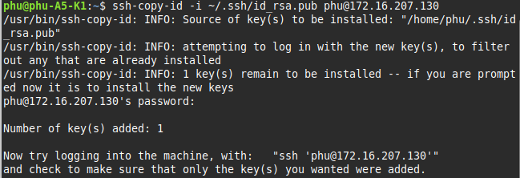
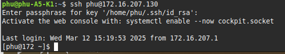

# Linux Command

## ping



ttl: Time to live chỉ số lượt hay hop của packet tồn tại trong network (Router, DDiscard) trước khi bị xóa.

time: Round-Trip Time là thời gian mà gói tin icmp thực một vòng trong network.

## ssh

### Dùng Password

```bash
ssh phu@172.16.207.130
```


### Dùng key

Tạo key

```bash
ssh-keygen -t rsa -b 4096
```


Copy Public Key cho Server

```bash
ssh-copy-id -i ~/.ssh/id_rsa.pub phu@172.16.207.130
```


Kết nối

```bash
ssh phu@172.16.207.130
```


### Dùng port custom

Cấu hình port ssh trên server


Kết nối

## scp

## rsync

## cat

## echo

## tail/head

## sed

## tracroute/tracert

## netstat

## sort

## wc

## find

## cp

## mv

## cut

## dig

## tar/zip/unzip

## mount/unmount

## Symbolic links, Hard Links

## ls

## ps

## kill

## top

## free

## df