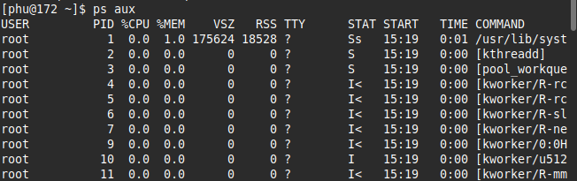

# Linux Command

## ping


ttl: Time to live chỉ số lượt hay hop của packet tồn tại trong network (Router, DDiscard) trước khi bị xóa.

time: Round-Trip Time là thời gian mà gói tin icmp thực một vòng trong network.

## ssh

### Dùng Password

```bash
ssh phu@172.16.207.130
```


### Dùng key

Tạo key

```bash
ssh-keygen -t rsa -b 4096
```


Copy Public Key cho Server

```bash
ssh-copy-id -i ~/.ssh/id_rsa.pub phu@172.16.207.130
```


Kết nối

```bash
ssh phu@172.16.207.130
```


### Dùng port custom

Cấu hình port ssh trên server

```bash
sudo vi /etc/ssh/sshd_config
```

Cấp phép firewall

```bash
sudo firewall-cmd --permanent --zone=public --add-port=3022/tcp
sudo firewall-cmd --reload
sudo firewall-cmd --list-port
```

Cấp phép Selinux

```bash
sudo dnf install policycoreutils-python-utils # sử dung khi semanage not found
sudo semanage port -a -t ssh_port_t -p tcp 3022
sudo semanage port -l | grep ssh_port_t
```

Khơi động lại sshd

```bash
sudo systemctl restart sshd
sudo systemctl status sshd
```


Kết nối

```bash
ssh -p 3022 phu@172.16.207.130
```


## scp

Chuyển thư mục
```bash
scp -P 3022 -r test phu@172.16.207.130:/home/phu
```
Chuyển tệp tin

```bash
scp result.txt phu@172.16.207.130:/home/phu
```

## rsync

```bash
rsync [options] source destination # lệnh cơ bản

# Lệnh đồng bộ với Remote host 
rsync [options] source user@host:destination
rsync [options] user@host:source destination
```
options thường 

## cat

## echo

## tail/head

## sed

## tracroute/tracert

## netstat

## sort

```bash
sort [options] file_name
```
sort là câu lệnh sắp xếp các dòng dữ liệu trên file

options thường dùng:

* mặc định: sắp xếp theo thứ tự của bảng chữ cái.
* r: sắp xếp theo thứ tự ngược lại.
* n: sắp xếp theo thứ tự số.
* k[số thứ tự của cột]: sắp xếp các dòng theo thứ tự sắp xếp của cột.

## wc

```bash
wc [options] file_name
```

options thường sử dụng:

* l: đếm số dòng trong tệp.
* w: đếm số từ trong tệp.
* c: đếm số byte trongg tệp.
* m: đếm số kỵ trự trong tệp.

## chmod/

### Symbolic

```bash
chmod [a|u/g/o][+|-|=][r/w/x] file name
```

* a: all
* u: user
* g: group
* o: other
* +: thêm
* -: xóa
* =: gán
* r: quyền đọc
* w: quyền ghi
* x: quyền thực thi

### Octal

```bash
chmod {u:1-7}{g:1-7}{o:1-7} file name
```

## chown

```bash
chown user:Group file
chown -R user:Group path/of/directory
```

## chattr

```bash
chattr [-R] [+|-][atrribute] file_or_directory_name
```
attribute:

* a: append only, chỉ cho phép thêm dữ liệu vào tệp, không thể ghi đè, phù hợp với tệp tin log.
* c: compresed, tệp tự động nén bởi kernel khi dược lưu trữ trên disk, khi đọc sẽ tự động giải nén.
* d: no dump, tệp bị loại trừ khỏi các bản sao được thực hiện bởi lệnh dump.
* i: immuatable, tệp hoặc thư mục không thể bị thay đổi: không thể xóa, đổi tên, ghi, hoạc tạo hard link, biện pháp bảo vệ dữ liệu mạnh.
* s: secure deletetion, khi tệp bị xóa, vũng lưu trữ của tệp sẽ được ghi đè bởi bit 0, ngăn chạn không thể phục hồi.
* u: undeletion, cho phép khôi phục dữ liệu khi đã xóa.
* A: no atime, thời gian truy cập (atime) của tệp sẽ không được cập nhập, có thể cải thiện hiệu suất đối với tệp có nhiều lượt truy cập.
* j: data journaling, tất cả dưc liệu của tệp sẽ được ghi nhật ký (journaled).
* e: extent format, tệp đang sử dụng định dạng extent để lưu trên disk.
* t: no tail-merging, vô hiệu hóa việc hợp nhất đuôi (tail-merging).

Kiểm tra thông tin thuộc tín của file 

```bash
lsattr [file_or_directory_name]
```

## find

```bash
find path/to/search [options]

find -type f -name "*.log" #Kiếm file có đuôi .log

find -type d -name "*abc*" #Tìm kiếm folder có tên abc 

find -type d -name "*abc*" -exec chmod -R 444 {} \; #Tìm kiếm folder abc và thay đổi quyền.
```

## cp

```bash
cp source_file destination
cp -r source/directory destination/directory
```

## mv

```bash

mv source destination

mv path/of/file path/of/destination

mv path/of/directory path/of/destination

mv old/name new/name

```

## cut

```bash
cut [option] {file name}

echo {string} | cut [option] #Xử lý chuỗi

echo {string} | cut -c {số thứ tự của ký tự} #cut ký tự thứ n của chuỗi stringS

echo {string} | cut -c {số thứ tự của ký tự}- #cut ký tự từ thứ n đến cuối string

echo {string} | cut -c 1-{số thứ tự của ký tự} # cut từ ký tự đầu đến ký tự n 

```

## dig

```bash
dig {domain name: example.com} #Kiểm tra tên miền có đang được trỏ đúng ip, thông qua A record

dig {domain name} {record name: CNAME, AAAA, MX, ....} #Kiểm tra bảng ghi của domain.

dig @{dns ip} {domain name} #Kiểm tra thông tin domain name trên 1 bảng ghi A record trên DNS khác với mặc định

dig -x 8.8.8.8 #Kiểm tra ip đang được gán trên domain nào

dig +trace {domain name} #Giải thích quy trình phân giải tên miền
```


## tar/zip/unzip

```bash
tar -cvf archvie_name.tar files_or_directories #Tạo file nén .tar

tar -czvf archvie_name.tar.gz files_or_directories #Tạo file nén .gz

tar -xvf archive_name.tar -C /path/to/destination # giải nén file tar
tar -xzvf archive_name.tar.gz -C /path/to/destination #giải nén file .tar.gz 
```

```bash
zip archvie_name.zip files #Tạo file nén .zip với file.

zip -r archvie_name.zip directories #Tạo file nén zip với folder

unzip archive_name.zip -d /path/to/destination
```

## mount/unmount

```bash
lsblk -f #Kiểm tra các disk được liên kết với hệ thống
sudo mkfs.ext4/mkfs.vfat/mkfs.ntfs device_name #format disk nếu chưa format 
# device_name là tên disk, ví dụ /dev/sda1
sudo mount device_name mount_point

#Gỡ thiết bị
sudo unmount mount_point
#hay
sudo unomount device_name
```

## Symbolic links, Hard Links

* Symbolic link chỉ đường dẫn tới file hoặc thư mục.

```bash
ln -s path/of/target link_name
```

* Hard Link chỉ inode của vùng dữ liệu, khi hard link bị xóa đi điều đó không có nghĩa dữ liệu sẽ bị xoá đi, dữ liện vẫn tồn tại miễn vẫn còn một hard link khác đang được liên kết.


```bash
ln path/of/target link_name
```

## ls

```bash
ls      # Liệt kê danh sách file/thư mục
ls -l   # Liệt kê danh sách file/thự mục là thuộc tính của chúng
ls -a   # Liệt kê danh sách file/thư mục kể cả đã ẩn
ls -R   # Liệt kê danh sách file/thưc mục và thư mục con và tệp tin chứa trong thư mục

```


## ps



* USER: process chạy dưới quyền user
* PID: processuser
* %CPU: tỷ lệ sử dụng CPU
* %MEM: tỷ lệ sử dụng RAM
* VSZ: Virtual memory size
* RSS: Resident set size
* TTY: Teletypewriter
* STAT: trạng thái process
* START: thời gian bắt đầu chạy
* Time: thời gian chạy process.
* CMD: lệnh chạy process.

## kill

```bash
kill -15 PID # (Mặc định) process được làm sạch trước khi đóng.
kill -9 PID # process bắt buộc bị đóng ngay lập tức.
```

## top


* Load average: thể hiện mức tải trung bình của CPU; thông số được biểu biến với 3 giá trị lần lượt có ý nghĩa là mức tải trung bình trong 1 phút, 3 phút, 15 phút; hệ số nhỏ hơn số nhân CPU nghĩa là đang tải bình thường, bằng với số nhân CPU có nghĩa CPU đang được chạy hết công suất 100%, lớn hơn số nhân có nghĩa CPU đang bị quá tải.
* us: user, tỷ lệ sử dụng của user.
* sy: system, tỷe lệ sử dụng của hệ thống (dịch vụ chính của hệ điều hành)
* ni: nice
* id: idle, tỷ lệ nhàn rỗi của CPU.
* wa: I/O wait, tỷ lệ chờ I/O.
* hi: hardware interupt, tỷ lệ hardware can thiệp và chiếm dụng CPU. 
* si: software interupt, tỷ lệ software can thiệp và chiếm dụng CPU.
* st: steal time, tỷ lệ can thiệp và chiếm dụng CPU của hệ thống ảo hóa.
* zombie process: process đã thực hiện xong nhiệm vụ (hoành thành vòng đời) nhưng vẫn còn tồn tại trong bảng ghi.
* sleeping process: process hiện tại không hoạt động và đang đợi sự kiện để tiến hành chạy.

## free


* Mem: Ram.
* Swap: swap page.
* Total: tổng dung lượng bộ nhớ (mặc định KB).
* Used: Dung lượng đang được chiếm dụng.
* Free: Dung lượng chưa được sử dụng
* shared: phần dung lượng đang được chia sẻ với tmpfs.
* buff/cache: phần dung lương đang được chiếm buffer và cache chiếm dụng.
* available: phần dung lượng sẵn sàng được cấp phát cho các application.

## df

