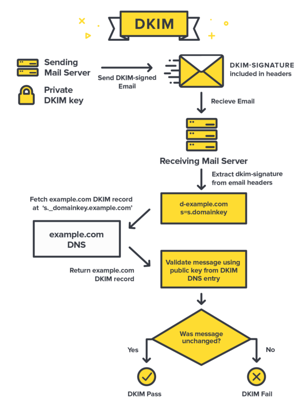
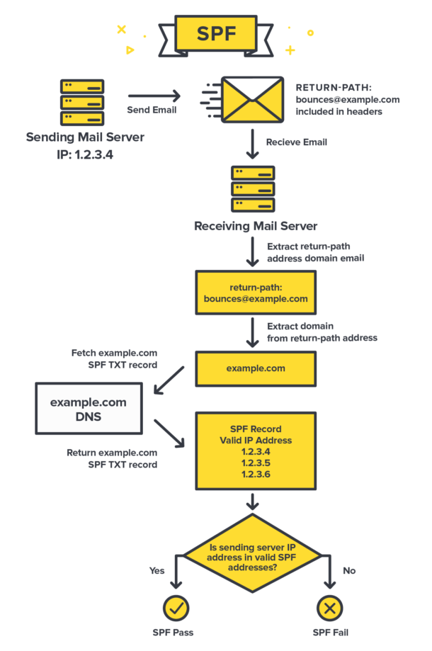

# Mail Server

## MX Record

Mail Exchange (MX) Record là bảng ghi hướng dẫn email được gửi đến tên miền phù hợp.  
Ví dụ: 

| example.com | record type: | priority: | value: | TTL |
|:---:|:---:|:---:|:---:|:---:|
| @ | MX | 10 | mailhost1.example.com | 45000 |
| @ | MX | 20 | mailhost2.example.com |45000 |

Giá trị priority trong bảng càng thấp thì thứ tự ưu tiên càng cao. Như ví trên, server sé ưu tiên chuyển email tới host 1 vì giá trị priority 10 thấp hơn 20, khi không thể gửi cho host 1, server sẽ chuyển mail tới host 2.

Nếu giá trị ưu tiên bằng nhau email sẽ được phân phối đến 2 host với số lượng bằng nhau.

## DKIM

DomainKeys Indentified Mail (DomainKeys Identified Mail) là một phương thức giúp xác nhận email thông qua chứ ký số.

## SPF

Sender Policy Framework (SPF) là một kỹ thuật xác nhận email, tránh spam, spnoofing và phishing, bằng cách thêm SPF record vào DNS.

## PTR

PTR (point) record là một bảng ghi DNS, gán địa chỉ IP với domain name.

