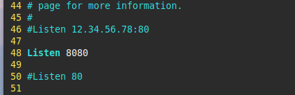
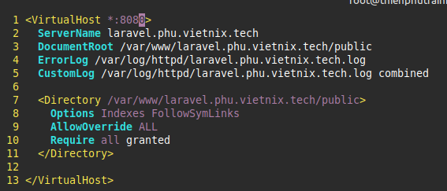
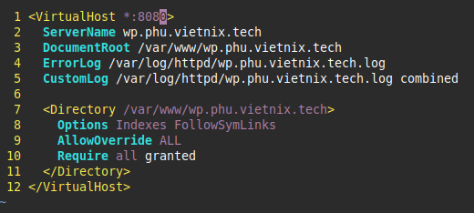
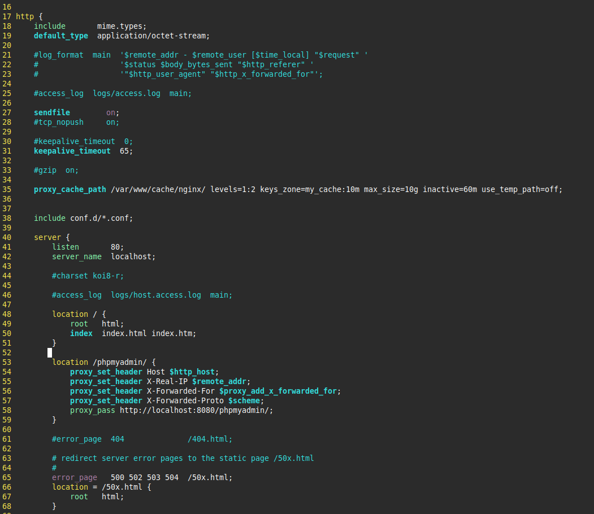
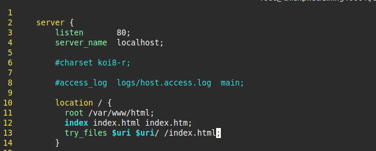

# Apache and Nginx

## Apache

Apache là phần mềm web server open source, thiết kế theo mô hình module có thể dễ dàng mở rộng và tùy chỉnh.

Tính năng chính của Apache:

* Run-time loadable MPMs
* Event MPM
* Asynchronuous support
* Per-module and per-directory LogLevel configuration
* Per-request configuration sections
* General-purpose expression parser
* KeepAliveTimeout in miliseconds
* NameVirtualHost directive
* Override Configuration
* Config file variables

## Nginx

Nginx (engin x) là phần mềm mã nguồn mở, được dùng cho HTTP web server, reverse proxy, content cache, load balancer, TCP/UDP proxy và Mail Server.

## Reverse Poxy

### Model

### Config

#### Config Apache

##### Config Apache cho website

Sửa port listen của Apache sang port 8080 

Cài đặt 02 trang web với doamin lần lượt là laravel.phu.vietnix.tech và wp.phu.vietnix.tech.

#### Cấu hình Reverse Proxy trên Nginx

Cấu hình file nginx conf, khai báo cache và xử lý path tới phpmyadmin 

Cấu hình trỏ 02 tên miền.

.png)

.png)

Cấu hình 01 trang web mặc định

