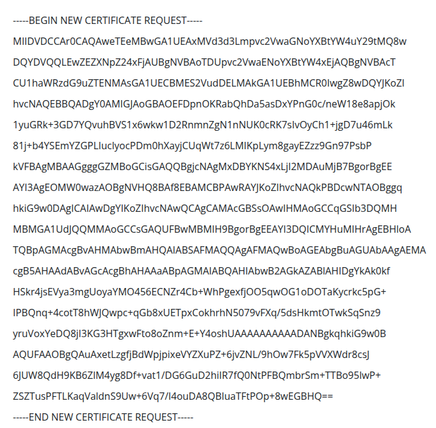

# SSL

## SSL là gì

SSL (Secure Socket Layer) là giao thức mã hóa Internet, đảm bảo tính bảo mật, xác thực và sự toàn vẹn của dữ liệu khi kết nối Internet. SSL là phiên bản tiền nhiệm của TLS (Transport Layer Security).  

* Đảm bảo được tính bảo mật, SSL mã hóa dữ liệu được truyền đi giữa các trang web. Khi có người thức ba cố gắng bắt gói tin để đọc thì thông tin sẽ được hiện thị chỉ là các ký tự lẫn lộn với nhau không thể giải mã hay đọc được.
* SSL tiến hành xác thực qua các bước trong quy trình bắt tay để thiết lập kết nối giữa hai thiết bị nhằm để chắc chắn rằng cả hai biết đến nhau.
* Để có thể đảm bảo tính toàn vẹn của dữ liệu, SSL đánh dấu các dữ liệu và xác thực đảm bảo nguyên vẹn.  

## Các loại chứng thực

Có 03 loại chứng thực SSL:

* Chứng thực tên miền (DV SSL, Domain Validated) là chứng thực dựa vào tên miền. Xác thực đơn giản, thông tin hiện thị trên SSL chỉ có tiên miền.
* Chứng thực tổ chức (OV SSL, Organization Validated) là chứng thực được xác nhận dựa trên sự tồn tại của tổ chức, doanh nghiệp. Thông tin hiện thị trên SSL bao gồm tên tổ chức/doanh nghiệp, quốc gia, địa chỉ, tên miền.
* Chứng thực mở rộng (EV SSL, Extenđe Validation) tương tự với với OV SSL, nhưng sẽ hiện thị thêm nhiều thông tin hơn và được đảm bảo có thể được sử dụng trên nhiều trình duyệt có tính bảo mật cao.

## Các cách chứng thực SSL 

* Xác thực Email: CA gửi email tới địa chỉ đã được liệt kê trong WHOIS record để người dùng xác nhận quyền sở hữu.
* Xác thực DNS: CA cấp một loại code chỉ cần thêm vào DNS record thì sẽ xác nhận domain.
* Xác thực HTML: CA cấp cho một file chỉ cần upload trên website, thì có thể xác nhận.

## CSR file

Certificate signing request (CSR) là file chứa các thông tin cần thiết để cơ quan cấp chứng thức (CA, Certìicate Authority) căn cứ và xác nhận cấp chứng thực SSL/TLS cho trang websiTLS.


## PEM file

Privacy Enchant Mail (PEM) là file được lưu dưới định dạng text và được mã hóa theo định dạng Base64. File lữu giữ một hoặc nhiều chứng thực và private key của các chứng thực. File được dùng nhiều trên hệ điều hành Unix/Linux.

## PFX file

Personal Information Exchange (PFX, PKCS#12) là file nhị phân, lưu giữ chứng thực X.509, private key và các chứng thực liên quan. PFX có thể được cài đặt mật khẩu để giới hạn khả năng có truy cập đến file. File được dùng phổ biến trên nền tảng Window.

## Private key của SSL

Private key là thành phần dữ liệu quan trọng trong mã hóa SSL, giúp giải mã dữ liệu được mã hóa bởi SSL/TTL, tạo Public key để mã hóa và xác thực dữ liệu.

## Sử dụng OpenSSL để tạo file CSR

Kiểm tra version OpenSSL

```bash
openssl -v
```

Tạo RSA Private Key và CSR

```bash
openssl req -new -newkey rsa:2048 -nodes -keyout trainning.vietnix.tech.key -out trainning.vietnix.tech.csr
```


Xác thực thông tin CSR

```bash
openssl req -text -in trainning.vietnix.tech.csr -noout -verify
```

Request SSL

```bash
openssl x509 -req -day 90 -in trainning.vietnix.tech.csr -signkey trainning.vietnix.tech.key -out trainning.vietnix.tech.crt
```

Kiểm tra 

```bash
openssl x509 -text -in trainning.vietnix.tech.crt -noout
```

```bash
openssl verify trainning.vietnix.tech.crt
```

## Chuyển đổi file .crt thành .pfx

```bash
openssl pkcs12 -export -out trainning.vietnix.tech.pfx -inkey trainning.vietnix.tech.key -in trainning.vietnix.tech.crt -certfile trainning.vietnix.tech.crt
```

